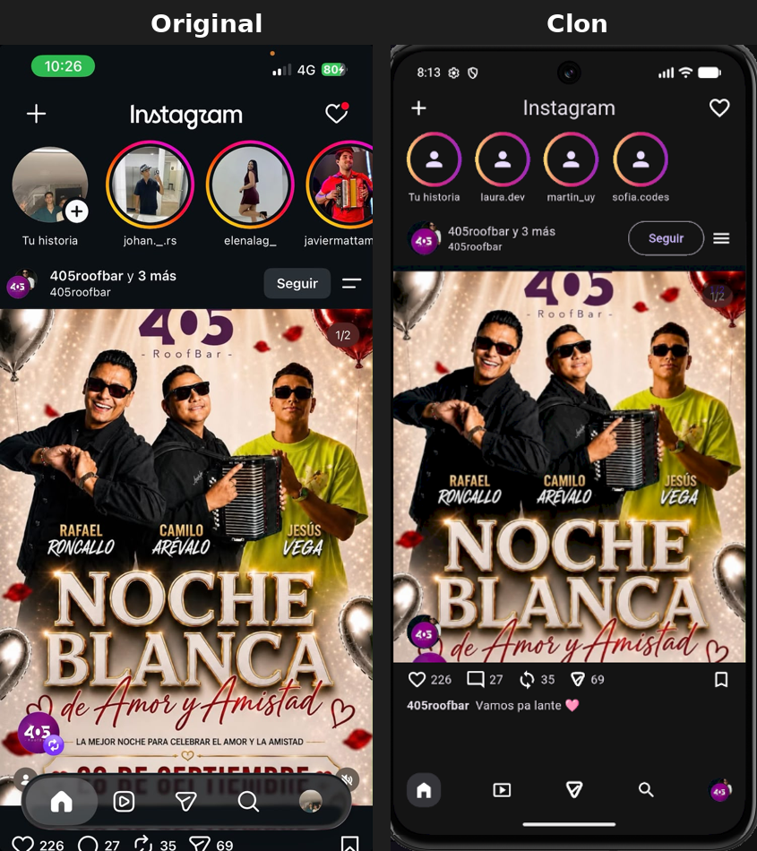

# Clonar una pantalla real - Instagram (perfil + post)

Laboratorio E03 - Semana 3, Sesion 2. Clon en Flutter del encabezado de perfil, un post y la barra de navegacion de Instagram, construido pixel a pixel a partir de una captura real de la app.

**Autor:** Reinel Alfaro

## Comparacion lado a lado

A la izquierda, la captura original tomada de la app de Instagram. A la derecha, el resultado de esta app corriendo en el emulador.

## Como correr el proyecto

cd clonar_instagram
flutter pub get
flutter run

## Estructura del proyecto

lib/main.dart - Punto de entrada y pantalla principal
lib/theme/app_colors.dart - Tokens de color de marca (degradado de historias)
lib/widgets/top_header.dart - Encabezado: + | Instagram | corazon
lib/widgets/stories_row.dart - Historias (scroll horizontal)
lib/widgets/post_header.dart - Info del post: avatar, usuario, Seguir, menu
lib/widgets/post_image.dart - Imagen del post + badges superpuestos (Stack)
lib/widgets/actions_bar.dart - Barra de acciones (like, comentar, compartir...)
lib/widgets/caption_text.dart - Texto de la publicacion
lib/widgets/bottom_nav_bar.dart - Barra de navegacion inferior
lib/widgets/triangle_icon.dart - Icono de compartir dibujado a mano (CustomPainter)

## Widgets de layout utilizados

| Widget | Donde se usa |
|---|---|
| Row | Encabezado superior, info del post, barra de acciones, navegacion inferior |
| Column | Estructura general de la pantalla, texto bajo cada historia |
| Stack + Positioned | Imagen del post con badges superpuestos |
| ListView.builder | Lista horizontal de historias |
| Expanded | Info del post (usuario), para que el texto no desborde |
| Spacer | Empuja la barra de navegacion al fondo de la pantalla |
| CustomPaint | Icono de compartir, dibujado a mano porque no existe en el set de iconos de Material |

## Cumplimiento de criterios (E03)

- Fidelidad visual: comparacion lado a lado incluida arriba
- Cero valores crudos: colores y tipografia provienen del tema, no sueltos en los widgets
- Widgets extraidos: cada seccion vive en su propio archivo, ningun build() supera las 60 lineas
- const donde corresponde
- flutter analyze sin advertencias
- Desplegada en web: (enlace pendiente de agregar tras el despliegue)

## Notas

Los nombres de usuario que aparecen en las historias (laura.dev, martin_uy, sofia.codes) son ficticios, generados unicamente para esta practica.
